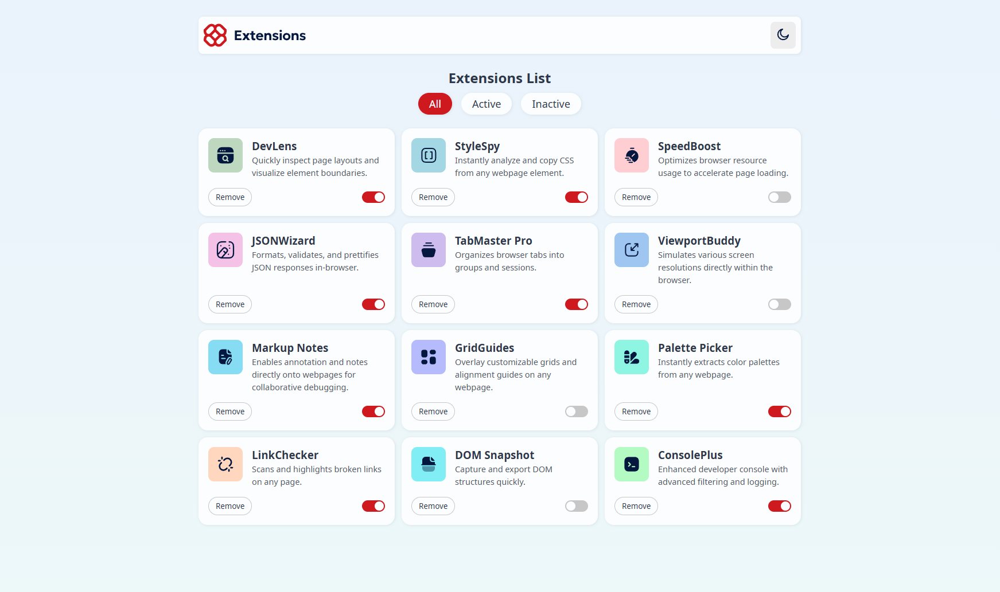

# Browser Extensions Manager UI

This project is a solution for the [Browser extensions manager UI challenge on Frontend Mentor](https://www.frontendmentor.io/challenges/browser-extension-manager-ui-yNZnOfsMAp). It is a responsive web app for managing browser extensions, built with React and TypeScript.

## Table of contents
- [Overview](#overview)
  - [Features](#features)
  - [Screenshot](#screenshot)
  - [Links](#links)
- [Tech Stack](#tech-stack)
- [What I learned](#what-i-learned)
- [Continued development](#continued-development)
- [Author](#author)

## Overview

### Features
- Toggle extensions between active and inactive states
- Filter extensions by active/inactive status
- Remove extensions from the list
- Switch between light and dark theme
- Responsive layout for mobile and desktop
- Smooth hover and focus states for all interactive elements

### Screenshot

### Links
- Solution URL: [https://github.com/3danan997/browser-extensions-manager-ui](https://github.com/3danan997/browser-extensions-manager-ui)
- Live Site URL: [https://your-live-site-url.com](https://your-live-site-url.com)

## Tech Stack
- React
- TypeScript
- CSS custom properties (variables)
- Flexbox & CSS Grid
- Mobile-first workflow
- Vite

## What I learned
- How to structure a React project for scalability and maintainability
- Using CSS custom properties for theming (light/dark mode)
- Handling state and filtering in React
- Creating reusable UI components (ExtensionCard, Navbar, Header)
- Responsive design with media queries

## Continued development
- Add extension details modal
- Add persistent storage for extensions (e.g. localStorage)
- Add animations for card removal and theme switching

## Author
- GitHub - [3danan997](https://github.com/3danan997)
- Frontend Mentor - [@3danan997](https://www.frontendmentor.io/profile/3danan997)

## Acknowledgments
Thanks to Frontend Mentor for the challenge and everyone in the community for feedback and inspiration.
